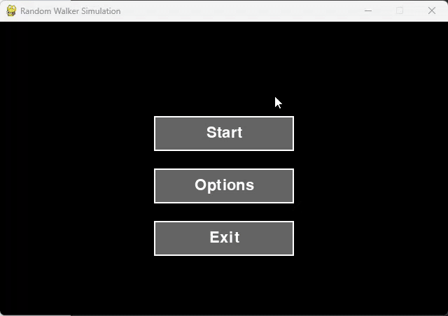
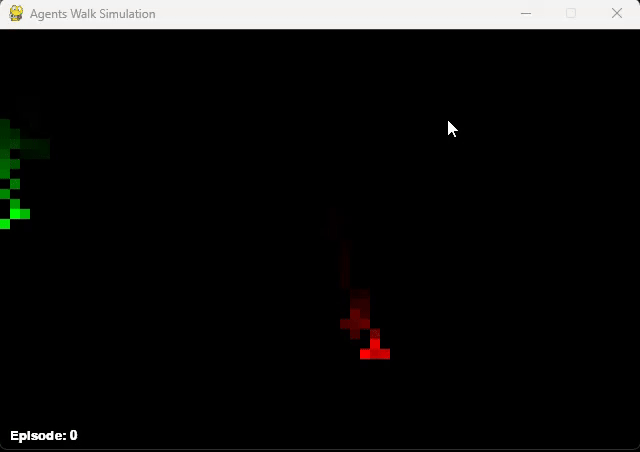

# 🌀 Random Walkers

This repository explores the concept of [random walks](https://en.wikipedia.org/wiki/Random_walk), a type of stochastic process where entities take a sequence of random steps in space. Often called the "drunkard's walk," it's a fundamental idea in probability, physics, and algorithmic art.

---

## Main Files

### 🚶‍♂️ `random_walkers.py`

This simulation starts with a group of walkers, each spawned at a random position within defined boundaries. Over time, they move according to different step-generation algorithms:

- **Classic Random Walkers**
  - Move randomly on the X and Y axes by selecting a value in the range (-1, 1) each frame.
  - Produce jittery and highly unpredictable paths.

- **Gaussian Walkers**
  - Each step is sampled from a Gaussian distribution with:
    - A random mean in the range (-5, 5)
    - A random standard deviation between (0, 2)
  - This creates more varied but still smooth movements.

- **Perlin Walkers**
  - Use [Perlin noise](https://en.wikipedia.org/wiki/Perlin_noise) to determine each step.
  - A random time offset is used to compute the noise, ensuring unique movement per walker.
  - Additional noise is injected to increase variability and create organic, flowing motion.

#### Additional Details

- Walkers leave behind a trail of their last 100 steps.
- At each frame, there's a very small chance (0.0001%) for a new walker to spawn, keeping the simulation dynamic over time.
- There's an option menu to change the number of walkers at the start of the simulation.
- Cool circle effect by pressing `ESC` to interrupt the simulation.

#### Visual Example:

> *Random walker simulation*

---

### 🧠 `agentsWalk.py`

This simulation introduces some basic concepts of [Reinforcement Learning](https://en.wikipedia.org/wiki/Reinforcement_learning), specifically using [Q-learning](https://en.wikipedia.org/wiki/Q-learning), through the interaction of two agents in a 2D environment.
Although it is not strictly a 'random walk' I decided to include it in this repository as I initially programmed it before going into the reiforcement learning part.

- The **green agent** (Agent 1) and the **red agent** (Agent 2) must get close to eachothers within a 100-second time window.
- Agents choose their actions using a Q-table, which updates over time based on:
  - **Learning rate**: `0.2`
  - **Discount factor**: `0.9`
  - **Exploration rate**: starts at `0.8` and decays gradually every few frames.

#### Additional Details:
- Trail effect using alpha transparency to visualize agent paths.
- Automatic reset of episodes after timeout or success (agents getting close).
- Agents don’t need to occupy the exact same cell—getting close is enough to trigger success (neighbouring cells).
- Exploration rate decays over time, with occasional resets to encourage re-exploration.
- Same cool circle effect from before pressing `ESC`.
---

#### Visual Example:

> *The green agent learns over time how to reach the red one faster.*

## Footnotes

- [Random Walk (Wikipedia)](https://en.wikipedia.org/wiki/Random_walk)
- [Perlin Noise (Wikipedia)](https://en.wikipedia.org/wiki/Perlin_noise)
- [Reinforcement Learning (Wikipedia)](https://en.wikipedia.org/wiki/Reinforcement_learning)
- [Q-table (Wikipedia)](https://en.wikipedia.org/wiki/Q-learning)
