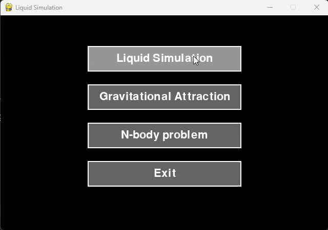
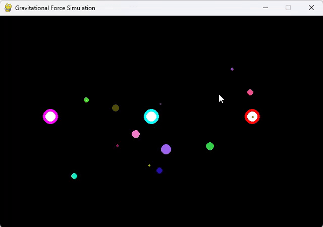
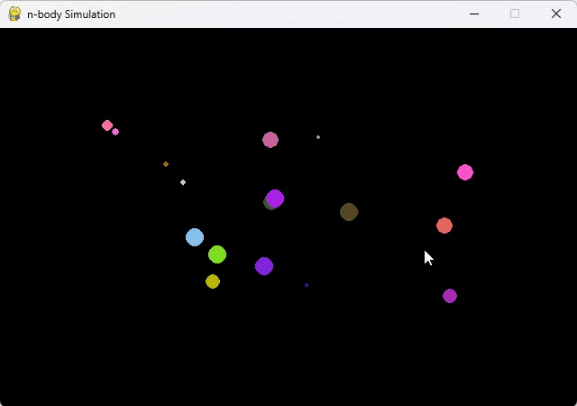

# 🌌 FORCES

This repository explores the physics of **forces** in 2D simulations using `pygame`. Each file demonstrates key mechanical principles like **drag**, **friction**, and **gravity**.

---

## Main Files

### `Main.py`
Contains all the simulation of this repository, which are explained in details afterwards.

### 🌊 `liquid simulation`

This simulation explores how objects behave when submerged in different liquids:

#### Simulated Forces:
- **Drag force**: Slows down falling objects in the liquid, applied on the Y axis.
- **Friction**: Slows horizontal movement when the object is in contact with the floor.
- **Gravity**: Constantly pulls objects down unless they're grounded.
- **Wind**: Apply a side force via `left mouse click`, direction depends on object position relative to the mouse.
- **Dynamic gravity**:
  - Press `Q` to **increase gravity** over time (until a max threshold).
  - Press `W` to apply **negative gravity**, lifting objects instead.

#### Liquids in Simulation:
- **Water**: Applies regular drag.
- **Oil**: Applies drag plus a buoyant-like bounce that may float lightweight objects back to the surface.

#### Visual Example

> The simulation displays the use of increased gravity and increased negative gravity, and also the use of wind. You can see how sometimes the drag force is almost null as the gravity is too much to handle.
---

### 🪐 `gravitational force`

Simulates basic attraction between free-moving objects and stationary attractors.

#### Key Concepts:
- **Attractors**: Fixed objects that pull nearby movers with gravitational force.
- **Movers**: Spawn randomly from canvas edges (*"from outer space"*) and get attracted toward attractors.
- **Spawning & Death**:
  - New movers or attractors spawn randomly during the simulation.
  - Movers die when exiting the screen.
  - Attractors "die" by shrinking away after depleting their metaphorical "fuel".

This setup simulates a dynamic star system where stars are born and collapse, attracting free-floating bodies from space.

####  Visual Example

> Simulation of the gravitational force, with the birth and death of attractors and also the birth of new movers from outer space.

---

### ☄️ `n body simulation`

An extension of the gravitational simulation, where **every object is a body** capable of both attracting and being attracted, the so called [n-body problem](https://en.wikipedia.org/wiki/N-body_problem).

#### Features:
- Combines the roles of movers and attractors into a single `Body` class.
- Each body interacts gravitationally with every other body.
- Bodies spawn randomly (1% chance per frame) and die upon leaving the screen.

####  Visual Example

  
> N bodies attracting each others.

---

## 🧠 Footnotes

- [N-body problem (Wikipedia)](https://en.wikipedia.org/wiki/N-body_problem)
- [Forces in physics (Wikipedia)](https://en.wikipedia.org/wiki/Force)
