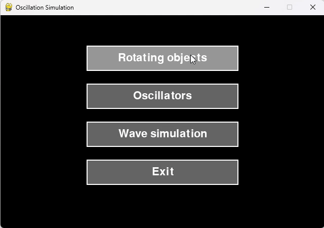
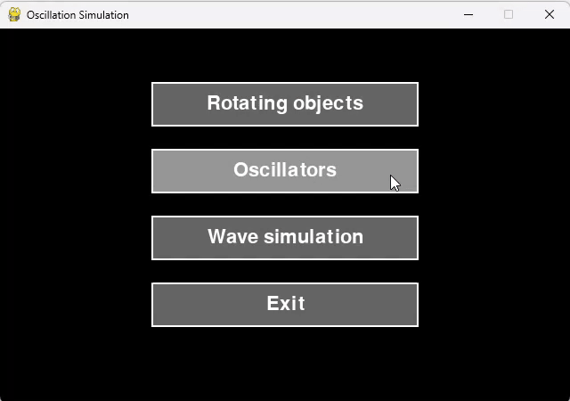
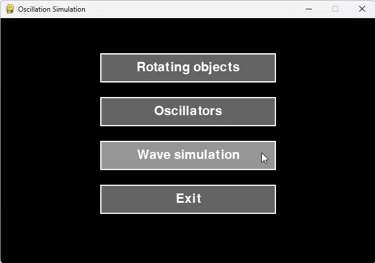
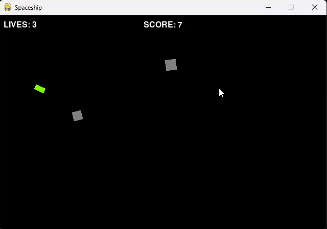
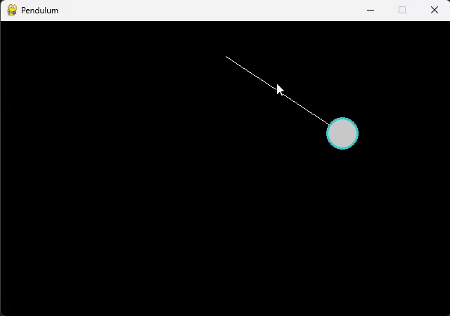
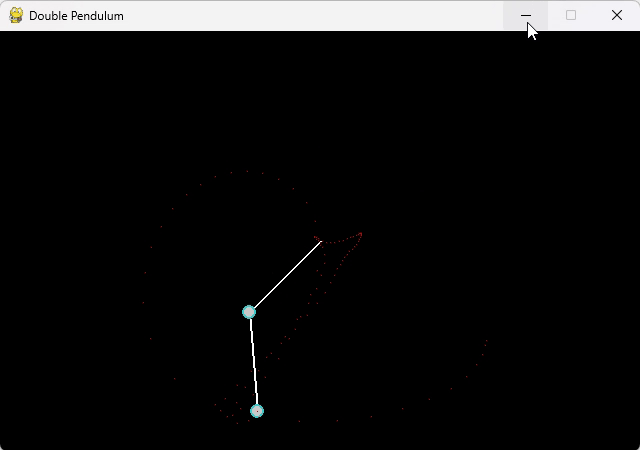

# 🎯 OSCILLATION

This repository explores different types of **oscillatory motion** and **dynamics**, combining physical systems and interactive elements. Each file represents a different theme: from mathematical waveforms to chaotic pendulums and arcade-style control.

---

## Main Files

### 🔄 `test_oscillation.py`

This file contains **three different simulations**, all focusing on oscillation and periodic behavior.

#### Rotating Movers
- A random number of objects called "Movers" appear on screen.
- Each rotates and accelerates both in **angle** and **position** toward the mouse cursor.

#### Oscillators
- Demonstrates classic **harmonic motion**.
- Each oscillator has a distinct frequency and amplitude.

#### Wave Simulation
- A compound wave created by stacking multiple **sine waves** together.
- Waves travel in both X and Y axes.
- 
#### Visual Example

  
  
  

> Visual example of the three simulations discussed before.

---

### 🚀 `spaceship.py`

A simple interactive game where you **control a spaceship** and **dodge incoming asteroids**.

- Press `Z` for thrust, i.e. going faster.
- The difficulty increases as time progresses.
- The game features player movement, obstacle generation, and collision detection.
- No game over screen, although the game pauses when 0 lifes are reached.
- Score increases when an asteroid goes out of the screen or hits the spaceship.

#### Visual Example
  
> Spacheship trying to avoid asteroids and ending up in a game over (game paused).
---

### 🕰️ `pendulum_simulation.py`

This file showcases two types of pendulum-based simulations.

#### Single Pendulum
- A classic damped pendulum that gradually slows down.
- Demonstrates predictable harmonic motion under the influence of gravity and friction.

#### Double Pendulum
- A chaotic system with two linked pendulums.
- The motion reflects real-world **sensitivity to initial conditions**.
- Leaves a trial of the last seen position of the second's pendulum center.
- Visually unpredictable, mimicking real chaotic systems in physics.

---

#### Visual Example

  
  

> Simulations of the pendulum and the double pendulum.

---

## 📚 Footnotes

- [Oscillation (Wikipedia)](https://en.wikipedia.org/wiki/Oscillation)
- [Simple Harmonic Motion (Wikipedia)](https://en.wikipedia.org/wiki/Harmonic_oscillator)
- [Double Pendulum (Wikipedia)](https://en.wikipedia.org/wiki/Double_pendulum)
