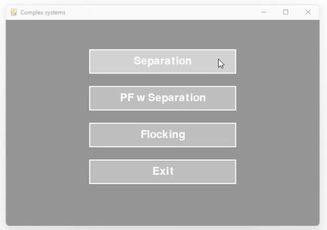

# 🤖 Autonomous Agents

This repository explores the fundamentals of **Autonomous Agents** through a series of interactive simulations, inspired by [Craig Reynolds](https://en.wikipedia.org/wiki/Craig_Reynolds_(computer_graphics))’ classic work on [boids](https://en.wikipedia.org/wiki/Boids) and steering behaviors.

---

## Main Files

### :arrow_heading_down: `steeringVehicle.py`

- Simulates a **vehicle** (agent) that follows a ball moving along a [Lemniscate of Bernoulli](https://en.wikipedia.org/wiki/Lemniscate_of_Bernoulli) path.
- Two steering modes:
  - **Seek mode**: moves toward the ball’s current position.
  - **Pursuit mode**: predicts and steers toward the ball’s future position.
- The modes interchange randomly throughout the simulation.

#### Visual Examples

> Agent (blue square) steering towards target (grey circle).

---

### :arrows_counterclockwise: `own_behaviour.py`

- The agent must **stay within a predefined rectangular boundary**.
- If it exits the area, it picks a random point on the nearest edge and steers back in.

#### Visual Examples

> Agent steers to stay inside the rectangle.

---

### :wavy_dash: `flowfields.py`

- Demonstrates **flow field navigation** where vehicles follow vector directions defined in a spatial grid.
- Supports **4 field generation types**:
  - `0`: random directions
  - `1`: Perlin noise-based smooth fields
  - `2`: circular fields
  - `3`: vectors pointing toward the center
- `Left click` to spawn new agents; switch field type via number keys.

#### Visual Examples

> Different flow fields applying forces on the agents.

---

### 🛣️ `path_following.py`

- The agent follows a **multi-segment path** using path prediction and steering behavior.
- Constantly looks for the closest point on the path and adjusts its trajectory accordingly.
- On canvas exit, simulation restarts with a new randomized path.

#### Visual Examples

> Vehicle tries to stay inside the path.

---

### 🌐 `complex_systems.py`

Includes three separate simulations that demonstrate how groups of agents interact using **local rules**:

#### 1. **Separation**

- Multiple agents avoid each other using **local repulsion**.
- Each agent checks neighbors within a radius and moves away proportionally.

#### 2. **Path Following + Separation**

- Multiple agents follow a path while maintaining **separation**.
- Same radius threshold is used to separate agents.

#### 3. **Flocking**

- Implements full **boid behavior**:  
  **Separation + Alignment + Cohesion**
- Real-time menu (press `TAB`) allows tuning of:
  - Each steering force
  - `max_velocity`
  - `max_force`
- Boids have two perception modes:
  - Full-radius (default)
  - Forward-facing **Field of View (FOV)** (press `C`)
- Toggle FOV visualization with `Q`.

---

#### Visual Examples

  
  
  

> *Left: separation; Center: pf w separation; Right: boid flocking.*

---

## 📚 Footnotes

- [Craig Reynolds (Wikipedia)](https://en.wikipedia.org/wiki/Craig_Reynolds_(computer_graphics))
- [Boids (Wikipedia)](https://en.wikipedia.org/wiki/Boids)  
- [Lemniscate of Bernoulli (Wikipedia)](https://en.wikipedia.org/wiki/Lemniscate_of_Bernoulli)
