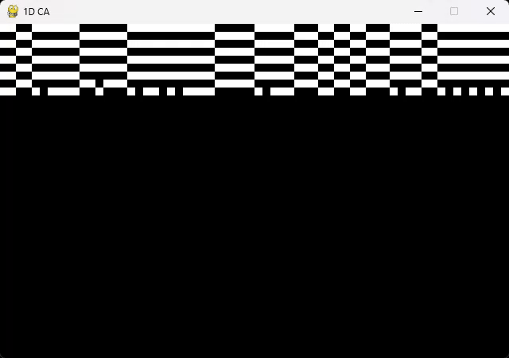

# 🧬 Cellular Automata

This repository explores the fundamentals of [Cellular Automata](https://en.wikipedia.org/wiki/Cellular_automaton), computational models made up of discrete cells that evolve over time based on local interaction rules.

One of the most iconic examples is **Conway’s Game of Life**, which showcases how simple rules can lead to complex, emergent behavior.

---

## Main Files

### 🔲 `1d_CA.py`

A basic **1D cellular automaton**:

- Each cell updates its state based on itself and its two neighbors.
- A new **random rule set** (8 total rules) is generated every generation.
- Generations are **stacked vertically**, giving a clear view of the time evolution.
- Patterns often reach stable or oscillatory configurations.

#### Visual Example

> Random rules at every step create unpredictable evolutions that often stabilize or repeat.

---

### 🧠 `game_of_life.py`

A minimal version of **Conway’s Game of Life**:

- Implements the original ruleset.
- Grid updates over time, showing how patterns grow, die, or stabilize.

#### Visual Example

> Classic patterns like gliders and still lifes can emerge naturally from random initial states.

---

### `oop_gol.py`

An **object-oriented** take on the Game of Life:

- Adds **color transitions** for visualizing state changes.
- Pressing `C` toggles a mode where **cell age is shown through fading effects**.

#### Visual Example

> Aging effect helps visualize the history of cells—newborns light up while old cells fade.

---

### `gol_variation.py`

A creative variation of the Game of Life:

- The canvas is split into **multiple regions**, each running its own simulation.
- Each region evolves independently, creating a layered and diverse grid dynamic.

#### Visual Example

> Each region lives its own "life"—some go still, some stay chaotic.

---

## 🔄 Controls

- Press `R` to reset the simulation (available in most scripts).
- Press `C` in `oop_gol.py` to toggle the aging visualization.

---

## 📚 Footnotes

- [Cellular Automata (Wikipedia)](https://en.wikipedia.org/wiki/Cellular_automaton)  
- [Game of Life (Wikipedia)](https://en.wikipedia.org/wiki/Conway%27s_Game_of_Life)
