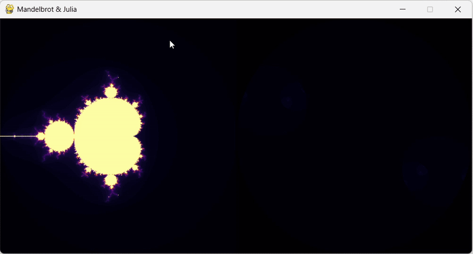

# ❄️ Fractals

This repository explores the fundamentals of [Fractals](https://en.wikipedia.org/wiki/Fractal), geometric figures where each part has a structure similar to the whole.  
It starts from simple deterministic fractals like the [**Cantor Set**](https://en.wikipedia.org/wiki/Cantor_set) and [**Koch Curve**](https://en.wikipedia.org/wiki/Koch_snowflake), and extends to more complex mathematical beauties like the [**Mandelbrot Set**](https://en.wikipedia.org/wiki/Mandelbrot_set), [**Julia Set**](https://en.wikipedia.org/wiki/Julia_set), and [**L-systems**](https://en.wikipedia.org/wiki/L-system).

---

## Main Files

### 🟣 `repeating_circles.py`

Contains two simulations testing **backtracking effects with circles**:

- The first one displays an infinte loop of expanding circles, giving the effect of a tunnel like shape and constant motion.
- The second one creates an intricate pattern with overlapping circles, which constantly follows a shrinking and an expansion.
  
#### Visual Example

> TO DO.

---

### 🧱 `deterministic_fractals.py`

A bundle of **classic fractal simulations**:

- **Cantor Set** with a twist: it **rotates over time** and supports a, you guessed it! `circle` variation via the `C` key. Press `R` to reset, `N` to stop the rotation.
- **Koch Curve** with adjustable recursion depth via a slider.
- **Koch Snowflake** follows the same principle—recursive construction with dynamic control.

#### Visual Example

> TO DO.

---

### 🌌 `mandelbrot.py`

Pretty self explanatory name, or is it? The simulation is actually an hybrid visualization of the **Mandelbrot** and **Julia Sets**:

- Left side shows the **static Mandelbrot Set**.
- Right side dynamically displays the **Julia Set**, generated from the mouse position over the Mandelbrot.
- Use `mouse wheel` to zoom in or out, `P` to pause the Julia update, and `R` to reset.

#### Visual Example

> TO DO.

> ⚠️ Note: not optimized — performance may vary.

---

### 🌳 `trees.py`

Three simulations of [**Fractal Trees**](https://en.wikipedia.org/wiki/Fractal_canopy):

- A **basic tree** with sliders for branch angle, decay factor, and recursion depth.
- A **construction visualizer**, showing the recursive backpropagation step-by-step.
- A **random tree generator**, re-randomizing each frame, which made me laugh, so deal with it, you get a new tree every frame.

#### Visual Example

> TO DO.

---

### 🌿 `l_systems.py`

A smooth and flowing implementation of **L-systems**:

- Uses standard deterministic rules to generate recursive patterns.
- Branch angle is adjustable via a slider.
- Animation includes a **sinusoidal oscillation**, mimicking seaweed moved by underwater currents.

#### Visual Example

> TO DO.

---

## 📚 Footnotes

- [Fractal (Wikipedia)](https://en.wikipedia.org/wiki/Fractal)  
- [Cantor Set](https://en.wikipedia.org/wiki/Cantor_set)  
- [Koch Curve](https://en.wikipedia.org/wiki/Koch_snowflake)  
- [Mandelbrot Set](https://en.wikipedia.org/wiki/Mandelbrot_set)  
- [Julia Set](https://en.wikipedia.org/wiki/Julia_set)  
- [L-systems](https://en.wikipedia.org/wiki/L-system)  
- [Fractal Trees](https://en.wikipedia.org/wiki/Fractal_canopy)
