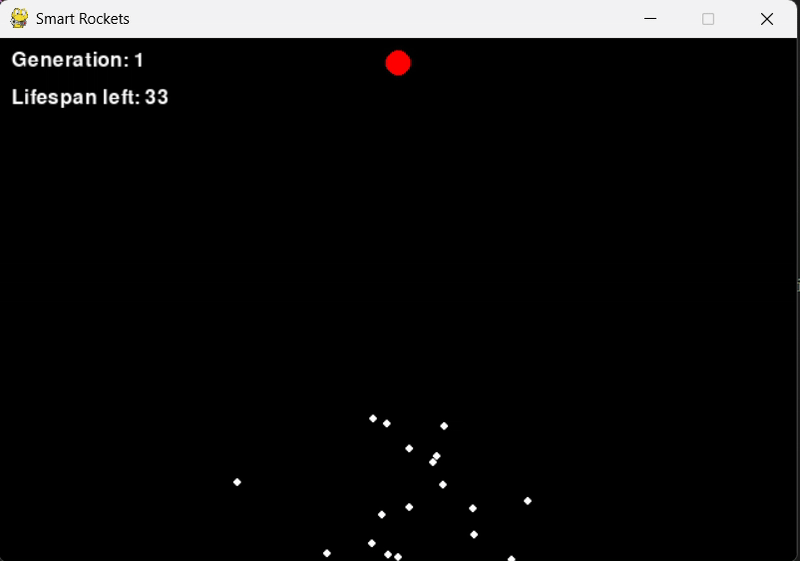
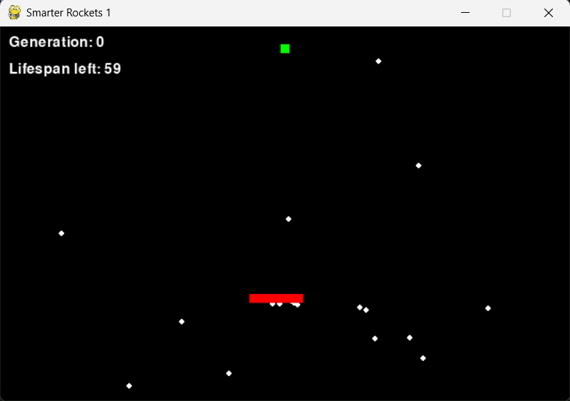
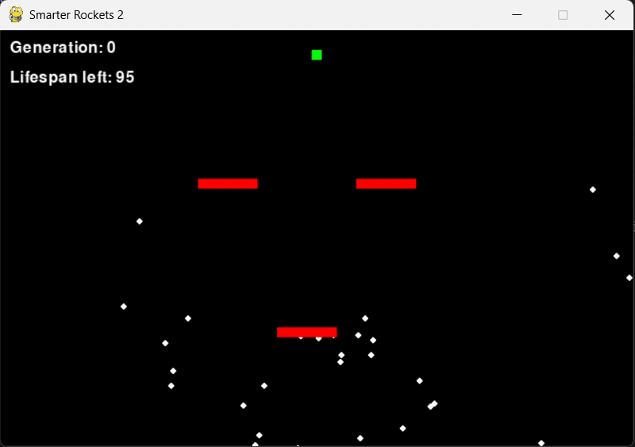
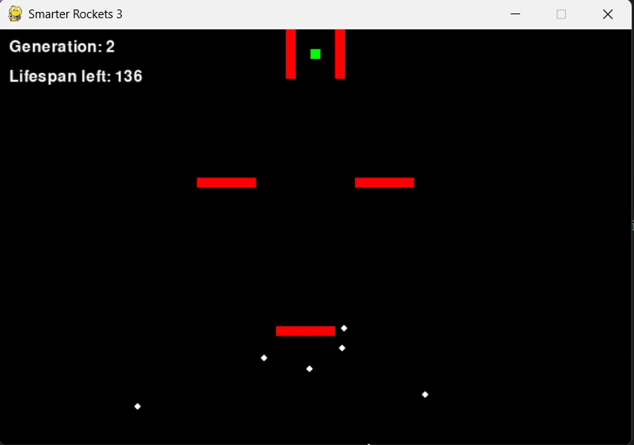

# 🔬 Evolutionary Computing

This repository explores the fundamentals of [Evolutionary Computation](https://en.wikipedia.org/wiki/Evolutionary_computation). It includes three different simulations that demonstrate key concepts of genetic algorithms such as mutation, crossover, and fitness-based optimization.

---

## Main Files

### 🐒 `writing_monkeys.py`

Inspired by the [Infinite Monkey Theorem](https://en.wikipedia.org/wiki/Infinite_monkey_theorem), this simulation tries to randomly evolve a string to match a target phrase. Although we don’t attempt to recreate the entire works of Shakespeare, the idea remains the same.

- Utilizes basic genetic algorithm mechanisms:
  - [Mutation](https://en.wikipedia.org/wiki/Mutation_(evolutionary_algorithm))
  - [Crossover](https://en.wikipedia.org/wiki/Crossover_(evolutionary_algorithm))
- The mutation rate can be increased or decreased using the `+` and `-` keys.
- A fitness function measures how close each generation gets to the target phrase.

#### Visual Example

> Learning a really normal phrase.
---

### 🚀 `smart_rockets.py`

This file includes four simulations where rockets must reach a target before a time limit.

- The optimization problem lies in finding the optimal path to the target.
- Each rocket's behavior is governed by DNA sequences encoding movement vectors.
- Fitness is based on proximity to the target and whether the rocket crashes or reaches the goal.
- The last three simulations introduce:
  - Smarter rockets (with modified fitness strategies)
  - More complex obstacle courses

#### Visual Example

  
  
  
  

> 4 different simulations about evolutionary rockets.
---

### 🌱 `ecosystem.py`

Simulates a basic ecosystem of autonomous agents ("bloops") and food.

- Bloops:
  - Move using Perlin Noise for organic, pseudo-random behavior
  - Have a lifespan that decreases over time, but increases when they eat food
  - Are governed by genetic parameters: smaller bloops move faster, but may have disadvantages
  - Can reproduce and pass on (mutated) DNA to offspring
- Food:
  - Spawns randomly over time to keep the system dynamic

#### Visual Example

> Bloops trying to survive eating food.
---

## Footnotes

- [Evolutionary Computation (Wikipedia)](https://en.wikipedia.org/wiki/Evolutionary_computation)
- [Infinite Monkey Theorem (Wikipedia)](https://en.wikipedia.org/wiki/Infinite_monkey_theorem)
- [Mutation in Genetic Algorithms (Wikipedia)](https://en.wikipedia.org/wiki/Mutation_(evolutionary_algorithm))
- [Crossover in Genetic Algorithms (Wikipedia)](https://en.wikipedia.org/wiki/Crossover_(evolutionary_algorithm))
