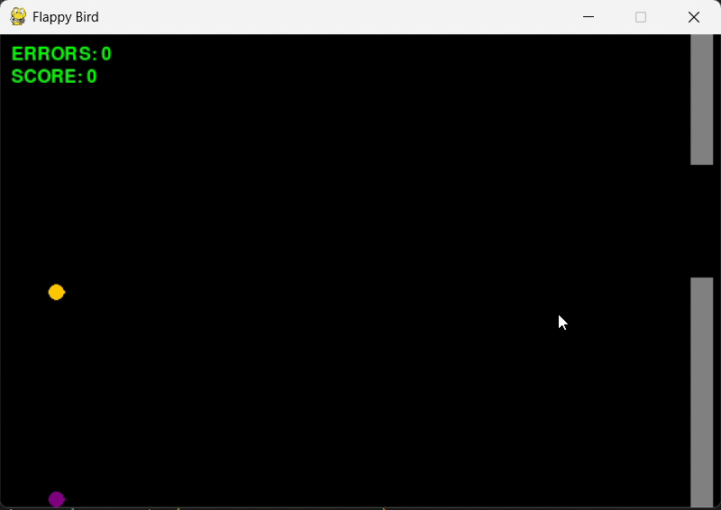
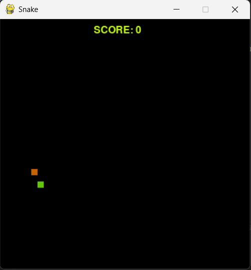

# 🤖 Neuroevolution

This repository explores the fundamentals of [Neuroevolution](https://en.wikipedia.org/wiki/Neuroevolution). It includes four different simulations that apply evolutionary strategies to train simple neural networks in two well-known games: Flappy Bird and Snake.

---

## Main Files

### 🐤 flappy_bird.py

A replica of the classic [Flappy Bird](https://it.wikipedia.org/wiki/Flappy_Bird) game.  
If you have a pre-trained bird brain saved in the `weights/` folder, it will automatically compete against an enemy bird.  
You can disable this behavior by pressing the `P` key.

#### Visual Example

> Le flappy bird.
---

### 🧬 evolutionary_flappy_bird.py

This simulation evolves a simple neural network (2 linear layers) to master Flappy Bird.  
Each generation spawns a population of birds that play until all are eliminated. Then, the best performers are selected, and genetic operators like mutation and crossover are applied to generate the next generation. The best model is saved in the `weights/` folder.

**Inputs to the neural network:**

- Bird’s vertical position 
- Bird’s vertical velocity
- Vertical position of the next bottom pipe
- Horizontal distance to the pipe

All inputs are normalized.  
The output is binary: **flap or not**.

> This minimal setup was enough to achieve strong performance, but can be extended for finer control.

#### Visual Example

> Birds learning to navigate pipes across generations.
---

### 🐍 snake.py

A faithful recreation of the timeless [Snake](https://en.wikipedia.org/wiki/Snake_(video_game_genre)) game.  
Random food spawns on the screen, and your goal is simple: eat and grow. No walls, no obstacles, classic *Pac-Man* style wraparound. If you run into yourself, it’s game over.

#### Visual Example

> Classic snake.
---

### 🧠 evolutionary_snake.py

Like *evolutionary_flappy_bird.py*, but tailored for Snake, and quite a bit harder.  
To avoid unintended behaviors (like endlessly moving straight to survive), I introduced:

- A timer per generation  
- A timeout if no food is eaten for too long

**Fitness function:**

- Illegal move (e.g. reversing direction): -10 pts  
- Eating food: +100 pts  
- Getting closer to food: +2 pts  
- Moving away: -1 pt  
- Survival: +0.1 pts per frame  

**Neural network architecture:**

- 3 linear layers: 64 → 32 → 16  
- Input: 16 normalized values:
  - Snake head position (x, y)
  - Food position (x, y)
  - Distance to food (x, y)
  - 4 directional indicators (binary): is food left, right, up, down?
  - 4 danger indicators (binary): will snake die if it turns in a certain direction?
  - Snake length
  - Last movement direction (encoded as floats)

Output is comprised of four different choices, which are the four cardinal position in which the snake can move, left, right, up and down.
> Again, this was my implementation, more variables or different parameters may produce a better outcome.
#### Visual Example

> Snakes evolving strategies to eat and survive.
---

## Footnotes

- [Neuroevolution (Wikipedia)](https://en.wikipedia.org/wiki/Neuroevolution)
- [Flappy Bird (Wikipedia)](https://it.wikipedia.org/wiki/Flappy_Bird)
- [Snake (Wikipedia)](https://en.wikipedia.org/wiki/Snake_(video_game_genre))
